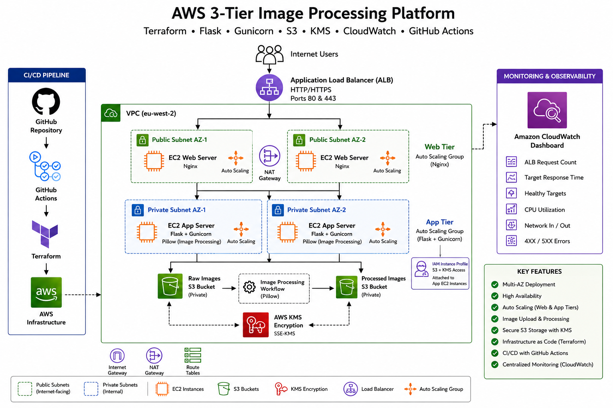
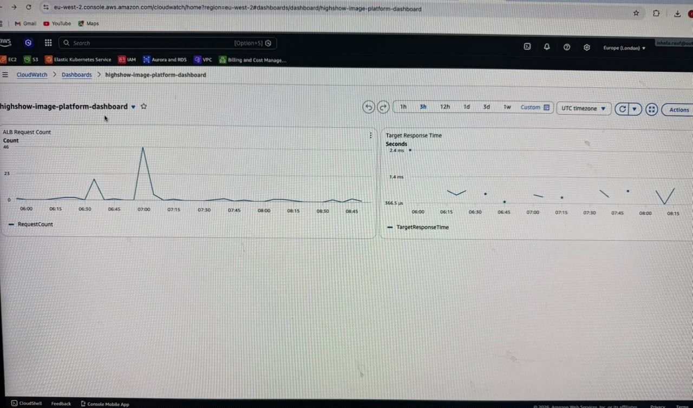
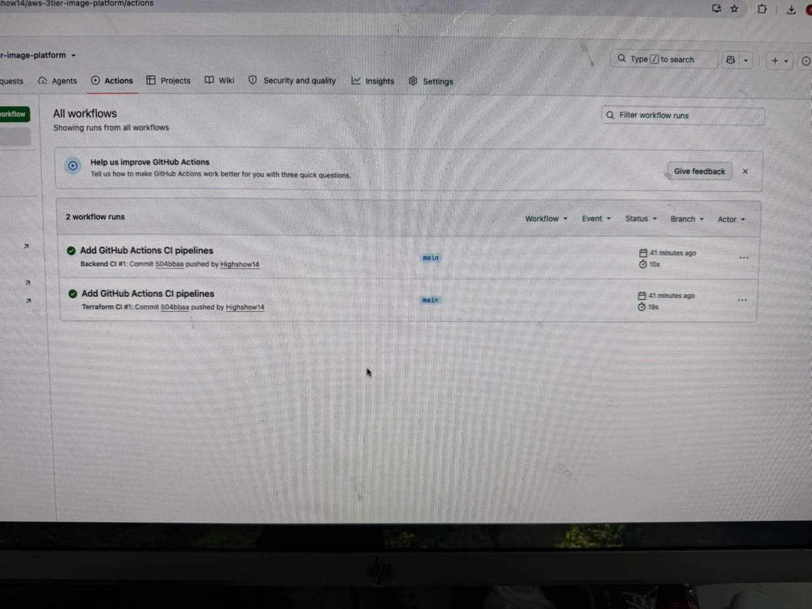
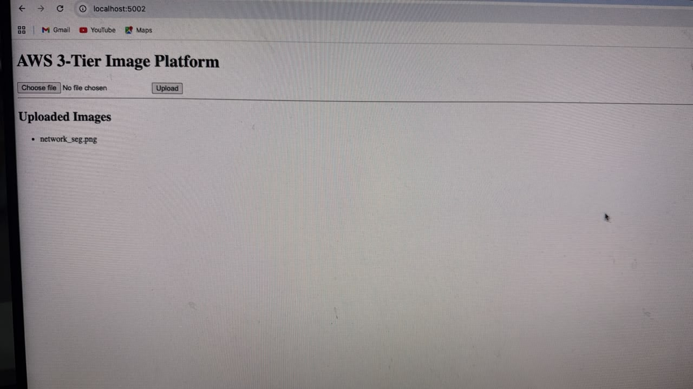

# AWS 3-Tier Image Processing Platform


## Overview

A production-style cloud-native image processing platform built on AWS using Terraform, Flask, Gunicorn, Amazon S3, AWS KMS, CloudWatch, Auto Scaling Groups, and GitHub Actions.

The platform enables users to upload images through a web interface, automatically processes images using Pillow, stores original and processed versions in separate Amazon S3 buckets, and provides centralized monitoring and infrastructure automation.

---

## Architecture



---

## Project Highlights

* Infrastructure as Code using Terraform
* Multi-AZ highly available architecture
* Application Load Balancer (ALB)
* Auto Scaling Groups for Web and Application tiers
* Secure image storage using Amazon S3
* AWS KMS encryption for data protection
* Flask and Gunicorn application deployment
* Automated image processing with Pillow
* CloudWatch monitoring and observability
* GitHub Actions CI/CD pipelines

---

## Architecture Overview

The platform follows a three-tier architecture:

### Presentation Tier

* Nginx Web Servers
* Application Load Balancer
* Public Subnets

### Application Tier

* Flask Application
* Gunicorn WSGI Server
* Pillow Image Processing
* Private Subnets

### Storage Tier

* Raw Images S3 Bucket
* Processed Images S3 Bucket
* AWS KMS Encryption

---

## Technology Stack

| Category               | Technology                |
| ---------------------- | ------------------------- |
| Cloud Platform         | AWS                       |
| Infrastructure as Code | Terraform                 |
| Load Balancing         | Application Load Balancer |
| Compute                | EC2 Auto Scaling Groups   |
| Web Tier               | Nginx                     |
| Application Framework  | Flask                     |
| WSGI Server            | Gunicorn                  |
| Image Processing       | Pillow                    |
| Storage                | Amazon S3                 |
| Encryption             | AWS KMS                   |
| Monitoring             | CloudWatch                |
| CI/CD                  | GitHub Actions            |
| Source Control         | GitHub                    |

---

## AWS Services Used

* Amazon VPC
* Amazon EC2
* Auto Scaling Groups
* Application Load Balancer
* Amazon S3
* AWS IAM
* AWS KMS
* Amazon CloudWatch
* Security Groups
* NAT Gateway
* Internet Gateway
* Route Tables

---

## Infrastructure Components

### Networking

* Custom VPC
* 2 Public Subnets
* 2 Private Subnets
* Internet Gateway
* NAT Gateway
* Route Tables

### Load Balancing

* Application Load Balancer
* HTTP and HTTPS support
* Health Checks

### Compute

#### Web Tier

* EC2 Instances
* Nginx
* Auto Scaling Group

#### Application Tier

* EC2 Instances
* Flask
* Gunicorn
* Pillow
* Auto Scaling Group

### Storage

#### Raw Images Bucket

Stores original uploaded images.

Example:

```text
network_seg.png
```

#### Processed Images Bucket

Stores resized and optimized images.

Example:

```text
processed-network_seg.png
```

---

## Image Processing Workflow

```text
User Upload
      │
      ▼
Flask Application
      │
      ▼
Raw S3 Bucket
      │
      ▼
Pillow Image Processing
      │
      ▼
Processed S3 Bucket
```

---

## Repository Structure

```text
aws-3tier-image-platform/
│
├── backend/
│   ├── app.py
│   ├── requirements.txt
│   ├── gunicorn.service
│   ├── templates/
│   └── static/
│
├── frontend/
│   ├── nginx/
│   └── scripts/
│
├── terraform/
│   ├── modules/
│   │   ├── alb/
│   │   ├── autoscaling/
│   │   ├── cloudwatch/
│   │   ├── iam/
│   │   ├── kms/
│   │   ├── s3/
│   │   ├── security-groups/
│   │   └── vpc/
│   │
│   ├── main.tf
│   ├── variables.tf
│   └── outputs.tf
│
├── diagrams/
│   └── aws-3tier-architecture.png
│
├── docs/
│   └── screenshots/
│
└── .github/
    └── workflows/
```

---

## CI/CD Pipeline

### Terraform Pipeline

Runs automatically on push:

```bash
terraform fmt -check
terraform init -backend=false
terraform validate
```

### Backend Pipeline

Runs automatically on push:

```bash
pip install -r requirements.txt
python -m py_compile app.py
```

---

## Monitoring & Observability

Amazon CloudWatch Dashboard includes:

* ALB Request Count
* Target Response Time
* Healthy Targets
* CPU Utilization
* Network In / Out
* HTTP Error Monitoring

---

## Screenshots

### Architecture Diagram


## CloudWatch Dashboard




## GitHub Actions



## Application UI



---

## Skills Demonstrated

* AWS Architecture Design
* Infrastructure as Code (Terraform)
* Linux Administration
* Python Development
* Flask Application Deployment
* Nginx Configuration
* Cloud Security
* Monitoring & Observability
* CI/CD Implementation
* Auto Scaling & High Availability

---

## Lessons Learned

* Designing secure multi-tier AWS architectures
* Implementing Infrastructure as Code using Terraform
* Managing IAM roles and least-privilege access
* Building image-processing workflows with Flask and Pillow
* Configuring Auto Scaling and Load Balancing
* Monitoring workloads using CloudWatch
* Automating validation with GitHub Actions

---

## Future Improvements

* HTTPS using AWS Certificate Manager (ACM)
* Route53 Custom Domain
* CloudFront CDN Integration
* AWS WAF Protection
* ECS/Fargate Migration
* Lambda-Based Image Processing
* Blue/Green Deployments
* Automated Terraform Deployments

---

## License

This project is provided for educational and portfolio purposes.
